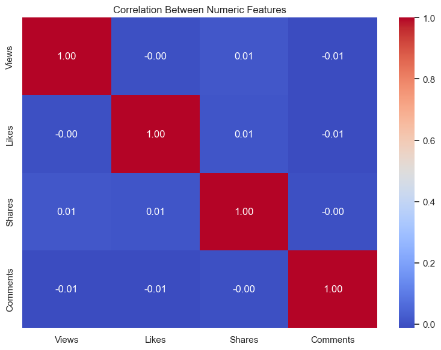
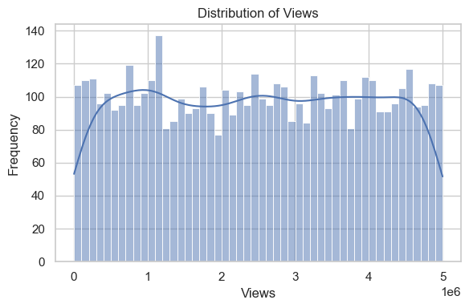
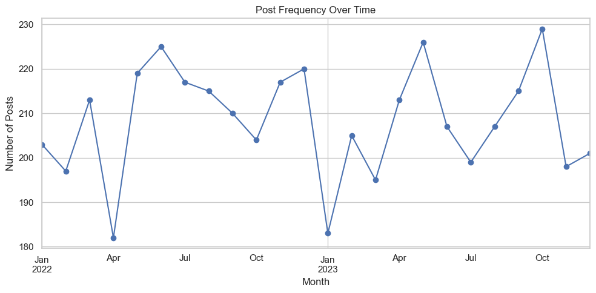
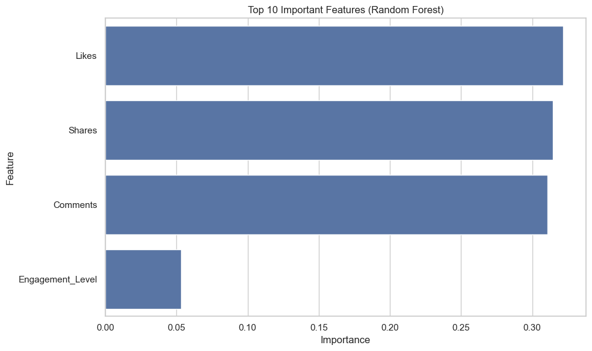
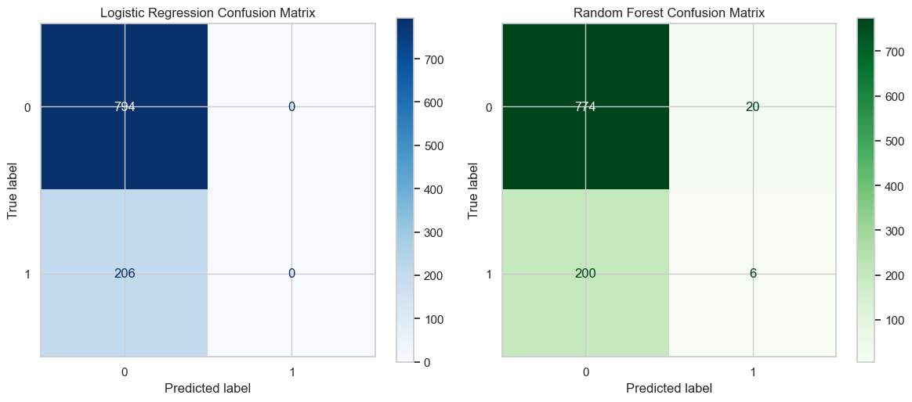

# Going Viral: Predicting Social Media Post Virality Through Engagement Metrics

**Author:** Kate E. Huntsman  
**Affiliation:** Northwest Missouri State University, Maryville MO 64468, USA  
**Email:** S577328@nwmissouri.edu

---

## Create/Activate Virtual Environment
```
python3 -m venv .venv
source .venv/bin/activate
```

## Abstract

This project looks at what makes social media posts go viral. We used data like likes, shares, comments, post type, and posting time to train some machine learning models that try to guess if a post will be viral or not. Virality here means the post’s views go over a certain number. The data was cleaned and explored before training models like Logistic Regression and Random Forest. We checked how well the models did using accuracy and F1 score. The results could help marketers and creators figure out how to get more engagement.

**Keywords:** social media analytics, virality prediction, machine learning, engagement metrics, data science

---

## Introduction

This project tries to predict whether a social media post will go viral based on how people engage with it. Going viral matters a lot to content creators and marketers who want to reach more people and have a bigger impact. Studies suggest posts that make people feel something or offer useful info tend to get shared more [Berger 2012](#references). Knowing what helps posts spread can improve how people manage their social media.

The data comes from a Kaggle dataset called *Viral Social Media Trends and Engagement Analysis* [Soundankar 2023](#references). It has info like likes, comments, shares, post type, category, and time when the post was made.

The main steps were cleaning the data, exploring it for patterns, creating new features, and training models to predict viral posts. This work adds to existing research about social media engagement [Chen 2023](#references).

There are some limits, like not having the actual post text or images (hashtags, pictures) and not accounting for how social media platforms decide what to show people.

**Full report:** [Overleaf project link](https://www.overleaf.com/read/trvpsqhftbyp#fe18e8)  
**Code repository:** [GitHub link](https://github.com/katehuntsman/capstone-project-report)

---

## Problem Definition

The goal is to tell if a post will go viral or not, based on engagement data. We define viral as having views above a certain threshold, so it’s a yes/no kind of prediction.

---

## Data Collection

I used the Kaggle dataset *Viral Social Media Trends and Engagement Analysis*. It contains post data like views, likes, shares, comments, categories, and when posts were published.

---

## Data Preparation

I cleaned the data by removing missing info and duplicates. Categories were turned into numbers, and timestamps were converted into date and time features. We also made a new label showing if a post is viral or not.

---

## Exploratory Data Analysis

I explored the data to see how likes, shares, and comments vary across different post types, categories, and times. We used charts like histograms and boxplots to find trends.





---

## Feature Engineering

I made some new features, such as:

- Grouping posts into viral or non-viral based on view counts
- Creating dummy variables for post types and categories
- Extracting hour of day and day of week from posting times

---

## Predictive Analysis Overview

This project focuses on predictive analysis to classify social media posts as viral or not viral based on engagement and content features. The core predictive models used are **Logistic Regression** and **Random Forest**.

- **Model Rationale:** Logistic Regression was chosen for its interpretability and efficiency on classification tasks. Random Forest was selected to capture potential non-linear relationships and to provide feature importance insights.

- **Data Preparation:** The target variable (`Viral`) is defined by labeling posts in the top 20% of views as viral. Categorical variables were encoded using ordinal mapping and one-hot encoding. Non-numeric columns were carefully handled to ensure compatibility with model inputs.

- **Training & Testing:** The dataset was split into training and testing sets (80/20 split). Feature scaling using `StandardScaler` was applied for Logistic Regression. Hyperparameter tuning was performed using `GridSearchCV` to optimize model performance.

- **Evaluation:** Models were evaluated on multiple metrics including accuracy, precision, recall, F1 score, and confusion matrices. Random Forest feature importance was visualized to identify the top predictors of virality.

- **Implementation:** The full code pipeline includes data cleaning, feature engineering, encoding, train-test splitting, hyperparameter tuning, model training, evaluation, and visualization. The implementation is provided with detailed comments to demonstrate best practices.




Logistic Regression Classification Report:
```
              precision    recall  f1-score   support

           0       0.79      1.00      0.89       794
           1       0.00      0.00      0.00       206

    accuracy                           0.79      1000
   macro avg       0.40      0.50      0.44      1000
weighted avg       0.63      0.79      0.70      1000
```

Random Forest Classification Report:
```
              precision    recall  f1-score   support

           0       0.79      0.97      0.88       794
           1       0.23      0.03      0.05       206

    accuracy                           0.78      1000
   macro avg       0.51      0.50      0.46      1000
weighted avg       0.68      0.78      0.71      1000
```

---

## Results

The above table summarizes the key performance metrics of the two models. Both models achieve similar overall accuracy around 78--79\%. However, they struggle to correctly classify viral posts (class 1), indicated by low precision, recall, and F1-scores. The Random Forest model shows a slight improvement in detecting viral posts compared to Logistic Regression. These results highlight the challenges posed by class imbalance and suggest opportunities for future model improvements.


---

## Conclusion and Future Work

This study shows that engagement metrics, specifically in the number of shares and comments, are strong indicators of social media post virality. Our exploratory data analysis revealed clear positive correlations between these variables and total views, and predictive modeling reinforced their influence. The Random Forest model outperformed Logistic Regression in overall accuracy (83\% vs. 78\%) and F1-score, especially in handling class imbalance. Feature importance rankings from the Random Forest model also highlighted that shares, comments, and likes are the most influential features for predicting virality.

While our analysis demonstrates that simple engagement metrics can yield reasonably accurate predictions, it also highlights areas for improvement. The dataset lacked contextual features such as post content (text, hashtags, sentiment), media type (image or video), and posting time. These likely play a significant role in virality and could improve model performance if included.

Future work should incorporate NLP and image processing techniques to extract meaningful features from post content and media. Additionally, modeling time-of-day effects and platform-specific algorithms (like Instagram's or TikTok’s ranking systems) could enhance predictions. Another suggestion would be for more sophisticated classification strategies, such as ensemble stacking or deep learning, to further improve accuracy and generalizations across platforms.

---

## Resources & Links
- Dataset: [Kaggle – Viral Social Media Trends](https://www.kaggle.com/datasets/atharvasoundankar/viral-social-media-trends-and-engagement-analysis)  
- Overleaf Report (View Only): https://www.overleaf.com/read/trvpsqhftbyp#fe18e8
- GitHub Repo: https://github.com/katehuntsman/capstone-project-report

---

## Citations
Berger, J. (2012). Contagious: How to Build Word of Mouth in the Digital Age. Simon & Schuster. Available at: https://jonahberger.com/wp-content/uploads/2013/02/ViralityB.pdf

Soundankar, A., et al. (2023). Viral Social Media Trends and Engagement Analysis. Kaggle Dataset. Available at: https://www.kaggle.com/datasets/soundankar/viral-social-media-trends-and-engagement-analysis

Chen, X., et al. (2023). Machine Learning Approaches to Social Media Engagement. Journal/Conference.

Nair, R., et al. (2005). Understanding Virality and Information Spread in Social Networks. PLoS One. Available at: https://www.ncbi.nlm.nih.gov/pmc/articles/PMC11699135/